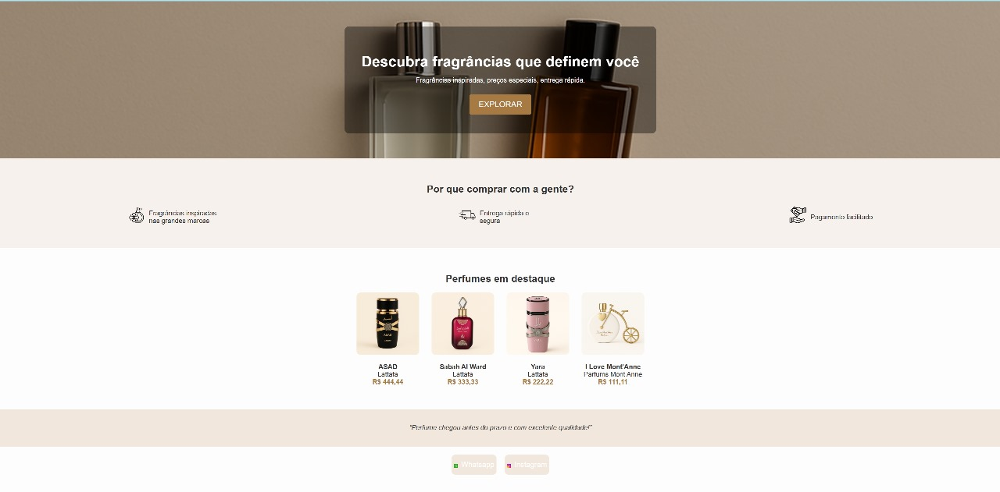

# AG STORE PERFUMES

Bem-vindo à **AG STORE**, sua nova loja online de fragrâncias marcantes e exclusivas!  
Nosso site foi desenvolvido para oferecer uma experiência prática, elegante e intuitiva.

---

## 🛒 O que você pode fazer no site:

- Visualizar perfumes em destaque na página inicial com imagens de alta qualidade.
- Explorar todos os produtos com **detalhes completos**, fotos adicionais e descrição da fragrância.
- Adicionar perfumes ao carrinho de forma rápida.
- **Acessar o carrinho de qualquer página** e finalizar compras com agilidade e segurança.
- Administradores podem adicionar, editar e remover produtos diretamente no painel exclusivo.

---

## 💎 Sobre a AG STORE

A AG STORE nasceu para transformar sua experiência com perfumes.  
Fragrâncias inspiradas nas melhores marcas, com um toque especial de exclusividade.

---

## 🚀 Tecnologias utilizadas

- HTML5, CSS3, JavaScript
- PHP (backend)
- JSON como base de dados
- LocalStorage (para o carrinho)

---

## 📸 Preview

> Abaixo, um exemplo da página de produtos com destaques:

---

## 🌐 Acesse online

📎 Em breve: [Link do site publicado aqui]

---

## 📁 Como executar localmente

1. Instale o [XAMPP](https://www.apachefriends.org/index.html)
2. Coloque os arquivos do projeto dentro da pasta `htdocs`
3. Inicie o Apache pelo painel do XAMPP
4. Acesse: `http://localhost/nome-da-pasta`

---

*Este projeto foi desenvolvido com fins educacionais e de portfólio.*